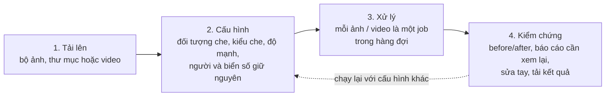

# Hình 1.2: Luồng sử dụng của RedactFunnel

```mermaid
flowchart LR
    A["1. Tải lên<br/>bộ ảnh, thư mục hoặc video"] --> B["2. Cấu hình<br/>đối tượng che, kiểu che, độ mạnh,<br/>người và biển số giữ nguyên"]
    B --> C["3. Xử lý<br/>mỗi ảnh / video là một job<br/>trong hàng đợi"]
    C --> D["4. Kiểm chứng<br/>before/after, báo cáo cần xem lại,<br/>sửa tay, tải kết quả"]
    D -. "chạy lại với cấu hình khác" .-> B
```
