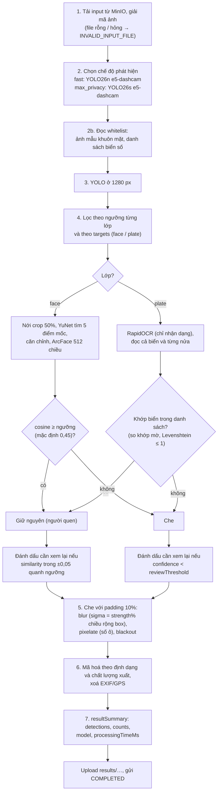

# Hình 3.10: Pipeline xử lý ảnh (image-redact)

Nguồn: engine/src/processors/image_redact.py (các bước 1-7 trong process()), face_embedding.py, plate_ocr.py.

```mermaid
flowchart TB
    A["1. Tải input từ MinIO, giải mã ảnh<br/>(file rỗng / hỏng → INVALID_INPUT_FILE)"] --> B["2. Chọn chế độ phát hiện<br/>fast: YOLO26n e5-dashcam<br/>max_privacy: YOLO26s e5-dashcam"]
    B --> C["2b. Đọc whitelist:<br/>ảnh mẫu khuôn mặt, danh sách biển số"]
    C --> D["3. YOLO ở 1280 px"]
    D --> E["4. Lọc theo ngưỡng từng lớp<br/>và theo targets (face / plate)"]
    E --> F{"Lớp?"}
    F -- face --> G["Nới crop 50%, YuNet tìm 5 điểm mốc,<br/>căn chỉnh, ArcFace 512 chiều"]
    G --> H{"cosine ≥ ngưỡng<br/>(mặc định 0,45)?"}
    F -- plate --> I["RapidOCR (chỉ nhận dạng),<br/>đọc cả biển và từng nửa"]
    I --> J{"Khớp biển trong danh sách?<br/>(so khớp mờ, Levenshtein ≤ 1)"}
    H -- có --> K["Giữ nguyên (người quen)"]
    J -- có --> K
    H -- không --> L["Che"]
    J -- không --> L
    K --> R["Đánh dấu cần xem lại nếu<br/>similarity trong ±0,05 quanh ngưỡng"]
    L --> R2["Đánh dấu cần xem lại nếu<br/>confidence < reviewThreshold"]
    R --> M["5. Che với padding 10%:<br/>blur (sigma = strength% chiều rộng box),<br/>pixelate (số ô), blackout"]
    R2 --> M
    M --> N["6. Mã hoá theo định dạng và chất lượng xuất,<br/>xoá EXIF/GPS"]
    N --> O["7. resultSummary: detections, counts,<br/>model, processingTimeMs"]
    O --> P["Upload results/…, gửi COMPLETED"]
```
