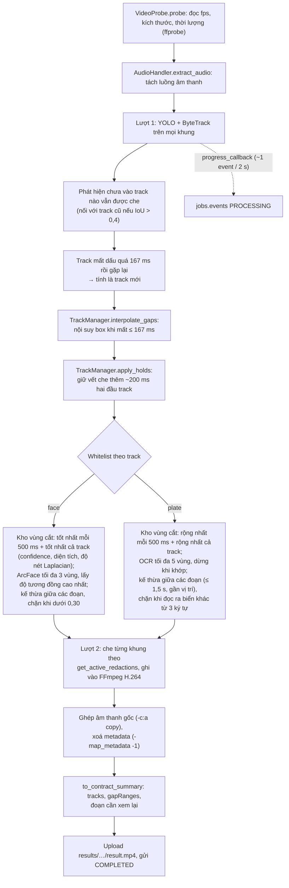

# Hình 3.11: Pipeline xử lý video (video-redact)

Nguồn: engine/src/processors/video_redact.py (docstring VideoRedactProcessor, TrackManager), decisions.md (C.1).

```mermaid
flowchart TB
    A["VideoProbe.probe: đọc fps, kích thước, thời lượng (ffprobe)"] --> B["AudioHandler.extract_audio: tách luồng âm thanh"]
    B --> C["Lượt 1: YOLO + ByteTrack trên mọi khung"]
    C --> C1["Phát hiện chưa vào track nào vẫn được che<br/>(nối với track cũ nếu IoU > 0,4)"]
    C1 --> C2["Track mất dấu quá 167 ms rồi gặp lại<br/>→ tính là track mới"]
    C2 --> D["TrackManager.interpolate_gaps:<br/>nội suy box khi mất ≤ 167 ms"]
    D --> E["TrackManager.apply_holds:<br/>giữ vết che thêm ~200 ms hai đầu track"]
    E --> F{"Whitelist theo track"}
    F -- face --> G["Kho vùng cắt: tốt nhất mỗi 500 ms + tốt nhất cả track<br/>(confidence, diện tích, độ nét Laplacian);<br/>ArcFace tối đa 3 vùng, lấy độ tương đồng cao nhất;<br/>kế thừa giữa các đoạn, chặn khi dưới 0,30"]
    F -- plate --> H["Kho vùng cắt: rộng nhất mỗi 500 ms + rộng nhất cả track;<br/>OCR tối đa 5 vùng, dừng khi khớp;<br/>kế thừa giữa các đoạn (≤ 1,5 s, gần vị trí),<br/>chặn khi đọc ra biển khác từ 3 ký tự"]
    G --> I["Lượt 2: che từng khung theo<br/>get_active_redactions, ghi vào FFmpeg H.264"]
    H --> I
    I --> J["Ghép âm thanh gốc (-c:a copy),<br/>xoá metadata (-map_metadata -1)"]
    J --> K["to_contract_summary: tracks, gapRanges,<br/>đoạn cần xem lại"]
    K --> L["Upload results/…/result.mp4, gửi COMPLETED"]
    C -. "progress_callback (~1 event / 2 s)" .-> P["jobs.events PROCESSING"]
```
