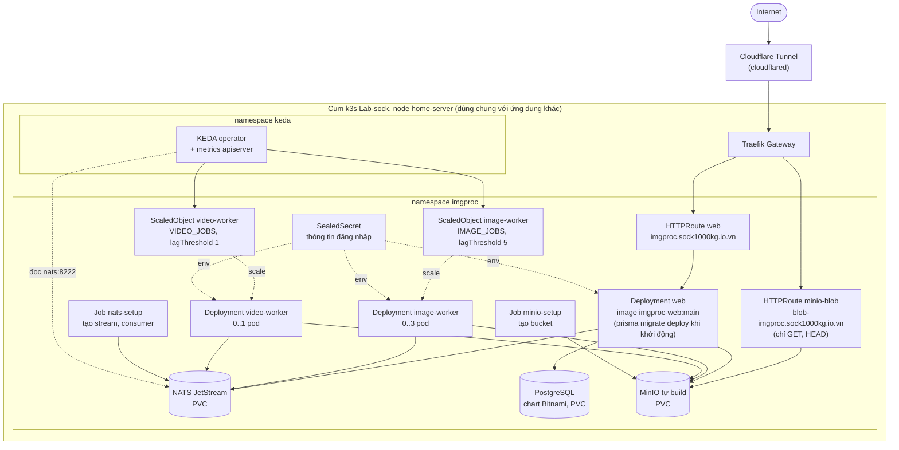

# Hình 3.12: Sơ đồ triển khai trên Kubernetes

Nguồn: infra/app/*, infra/cluster/keda, infra/AGENTS.md, decisions.md (G).

```mermaid
flowchart TB
    NET(["Internet"]) --> CF["Cloudflare Tunnel<br/>(cloudflared)"]

    subgraph LAB["Cụm k3s Lab-sock, node home-server (dùng chung với ứng dụng khác)"]
        GW["Traefik Gateway"]

        subgraph NS["namespace imgproc"]
            R1["HTTPRoute web<br/>imgproc.sock1000kg.io.vn"]
            R2["HTTPRoute minio-blob<br/>blob-imgproc.sock1000kg.io.vn<br/>(chỉ GET, HEAD)"]
            WEB["Deployment web<br/>image imgproc-web:main<br/>(prisma migrate deploy khi khởi động)"]
            IW["Deployment image-worker<br/>0..3 pod"]
            VW["Deployment video-worker<br/>0..1 pod"]
            NATS[("NATS JetStream<br/>PVC")]
            PG[("PostgreSQL<br/>chart Bitnami, PVC")]
            MINIO[("MinIO tự build<br/>PVC")]
            J1["Job nats-setup<br/>tạo stream, consumer"]
            J2["Job minio-setup<br/>tạo bucket"]
            SO1["ScaledObject image-worker<br/>IMAGE_JOBS, lagThreshold 5"]
            SO2["ScaledObject video-worker<br/>VIDEO_JOBS, lagThreshold 1"]
            SEC["SealedSecret<br/>thông tin đăng nhập"]
        end

        subgraph KNS["namespace keda"]
            KEDA["KEDA operator<br/>+ metrics apiserver"]
        end
    end

    CF --> GW
    GW --> R1 --> WEB
    GW --> R2 --> MINIO
    WEB --> PG
    WEB --> MINIO
    WEB --> NATS
    IW --> NATS
    VW --> NATS
    IW --> MINIO
    VW --> MINIO
    J1 --> NATS
    J2 --> MINIO
    KEDA -. "đọc nats:8222" .-> NATS
    KEDA --> SO1 -. scale .-> IW
    KEDA --> SO2 -. scale .-> VW
    SEC -. env .-> WEB
    SEC -. env .-> IW
    SEC -. env .-> VW
```
