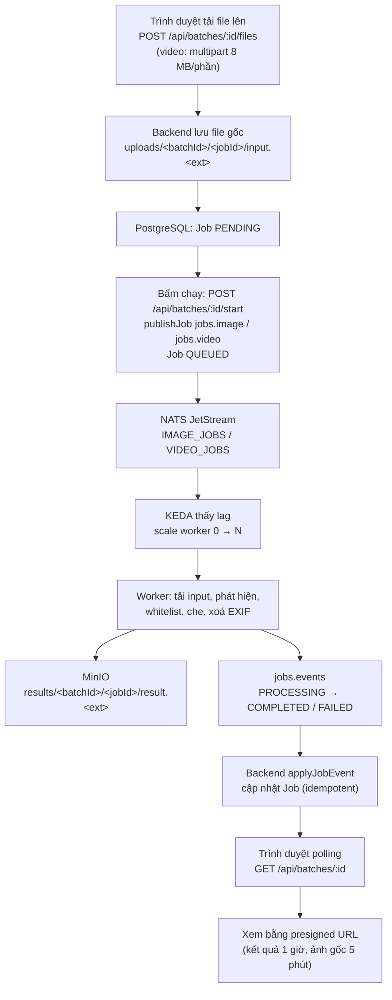

# Hình 3.2: Luồng dữ liệu end-to-end của một batch

```mermaid
flowchart TB
    A["Trình duyệt tải file lên<br/>POST /api/batches/:id/files<br/>(video: multipart 8 MB/phần)"] --> B["Backend lưu file gốc<br/>uploads/&lt;batchId&gt;/&lt;jobId&gt;/input.&lt;ext&gt;"]
    B --> C["PostgreSQL: Job PENDING"]
    C --> D["Bấm chạy: POST /api/batches/:id/start<br/>publishJob jobs.image / jobs.video<br/>Job QUEUED"]
    D --> E["NATS JetStream<br/>IMAGE_JOBS / VIDEO_JOBS"]
    E --> F["KEDA thấy lag<br/>scale worker 0 → N"]
    F --> G["Worker: tải input, phát hiện,<br/>whitelist, che, xoá EXIF"]
    G --> H["MinIO<br/>results/&lt;batchId&gt;/&lt;jobId&gt;/result.&lt;ext&gt;"]
    G --> I["jobs.events<br/>PROCESSING → COMPLETED / FAILED"]
    I --> J["Backend applyJobEvent<br/>cập nhật Job (idempotent)"]
    J --> K["Trình duyệt polling<br/>GET /api/batches/:id"]
    K --> L["Xem bằng presigned URL<br/>(kết quả 1 giờ, ảnh gốc 5 phút)"]
```
