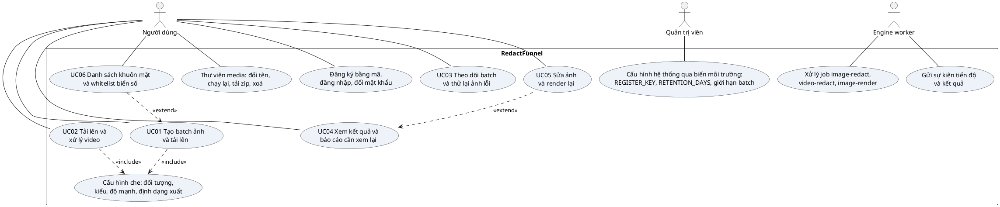

# Hình 3.3: Biểu đồ ca sử dụng tổng quát

Viết bằng PlantUML (Mermaid không có use case diagram). Layout Smetana nên không cần cài Graphviz.

```plantuml
@startuml
!pragma layout smetana
skinparam packageStyle rectangle
skinparam usecaseBackgroundColor #EEF3FA

actor "Người dùng" as User
actor "Quản trị viên" as Admin
actor "Engine worker" as Worker

rectangle "RedactFunnel" {
  usecase "Đăng ký bằng mã,\nđăng nhập, đổi mật khẩu" as A1
  usecase "UC01 Tạo batch ảnh\nvà tải lên" as U1
  usecase "UC02 Tải lên và\nxử lý video" as U2
  usecase "Cấu hình che: đối tượng,\nkiểu, độ mạnh, định dạng xuất" as C1
  usecase "UC03 Theo dõi batch\nvà thử lại ảnh lỗi" as U3
  usecase "UC04 Xem kết quả và\nbáo cáo cần xem lại" as U4
  usecase "UC05 Sửa ảnh\nvà render lại" as U5
  usecase "UC06 Danh sách khuôn mặt\nvà whitelist biển số" as U6
  usecase "Thư viện media: đổi tên,\nchạy lại, tải zip, xoá" as L1
  usecase "Cấu hình hệ thống qua biến môi trường:\nREGISTER_KEY, RETENTION_DAYS, giới hạn batch" as AD
  usecase "Xử lý job image-redact,\nvideo-redact, image-render" as W1
  usecase "Gửi sự kiện tiến độ\nvà kết quả" as W2
}

User -- A1
User -- U1
User -- U2
User -- U3
User -- U4
User -- U5
User -- U6
User -- L1
U1 ..> C1 : <<include>>
U2 ..> C1 : <<include>>
U6 ..> U1 : <<extend>>
U5 ..> U4 : <<extend>>
Admin -- AD
Worker -- W1
Worker -- W2
@enduml
```
