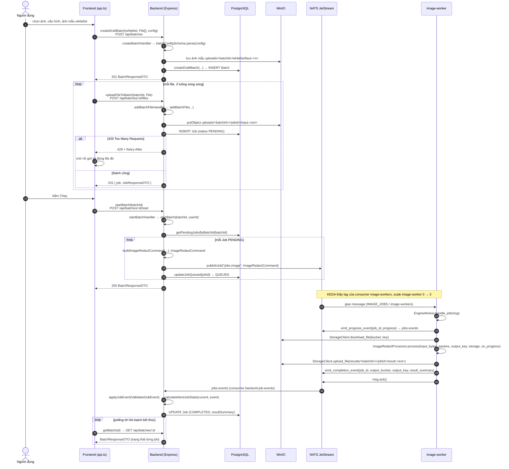

# Hình 3.5: Biểu đồ tuần tự ca sử dụng UC01 Tạo batch ảnh và tải lên

Tên hàm và kiểu dữ liệu lấy từ code: web/frontend/src/api.ts, web/backend/src/{controllers,services,domain}, engine/src.

```mermaid
sequenceDiagram
    autonumber
    actor U as Người dùng
    participant FE as Frontend (api.ts)
    participant BE as Backend (Express)
    participant PG as PostgreSQL
    participant S3 as MinIO
    participant MQ as NATS JetStream
    participant W as image-worker

    U->>FE: chọn ảnh, cấu hình, ảnh mẫu whitelist
    FE->>BE: createDraftBatch(whitelist: File[], config)<br/>POST /api/batches
    BE->>BE: createBatchHandler → batchConfigSchema.parse(config)
    BE->>S3: lưu ảnh mẫu uploads/<batchId>/whitelist/face-<n>
    BE->>PG: createDraftBatch(...) → INSERT Batch
    BE-->>FE: 201 BatchResponseDTO

    loop mỗi file, 2 luồng song song
        FE->>BE: uploadFileToBatch(batchId, File)<br/>POST /api/batches/:id/files
        BE->>BE: addBatchFileHandler → addBatchFile(...)
        BE->>S3: putObject uploads/<batchId>/<jobId>/input.<ext>
        BE->>PG: INSERT Job (status PENDING)
        alt 429 Too Many Requests
            BE-->>FE: 429 + Retry-After
            FE->>FE: chờ rồi gửi lại đúng file đó
        else thành công
            BE-->>FE: 201 { job: JobResponseDTO }
        end
    end

    U->>FE: bấm Chạy
    FE->>BE: startBatch(batchId)<br/>POST /api/batches/:id/start
    BE->>BE: startBatchHandler → startBatch(batchId, userId)
    BE->>PG: getPendingJobsByBatchId(batchId)
    loop mỗi Job PENDING
        BE->>BE: buildImageRedactCommand(...): ImageRedactCommand
        BE->>MQ: publishJob("jobs.image", ImageRedactCommand)
        BE->>PG: updateJobQueued(jobId) → QUEUED
    end
    BE-->>FE: 200 BatchResponseDTO

    Note over MQ,W: KEDA thấy lag của consumer image-workers, scale image-worker 0 → 3
    MQ->>W: giao message (IMAGE_JOBS / image-workers)
    W->>W: EngineWorker.handle_job(msg)
    W->>MQ: emit_progress_event(job_id, progress) → jobs.events
    W->>S3: StorageClient.download_file(bucket, key)
    W->>W: ImageRedactProcessor.process(input_bytes, params, output_key, storage, on_progress)
    W->>S3: StorageClient.upload_file(results/<batchId>/<jobId>/result.<ext>)
    W->>MQ: emit_completion_event(job_id, output_bucket, output_key, result_summary)
    W->>MQ: msg.ack()

    MQ->>BE: jobs.events (consumer backend-job-events)
    BE->>BE: applyJobEvent(ValidatedJobEvent) → calculateNextJobState(current, event)
    BE->>PG: UPDATE Job (COMPLETED, resultSummary)

    loop polling tới khi batch kết thúc
        FE->>BE: getBatch(id) → GET /api/batches/:id
        BE-->>FE: BatchResponseDTO (trạng thái từng job)
    end
```
