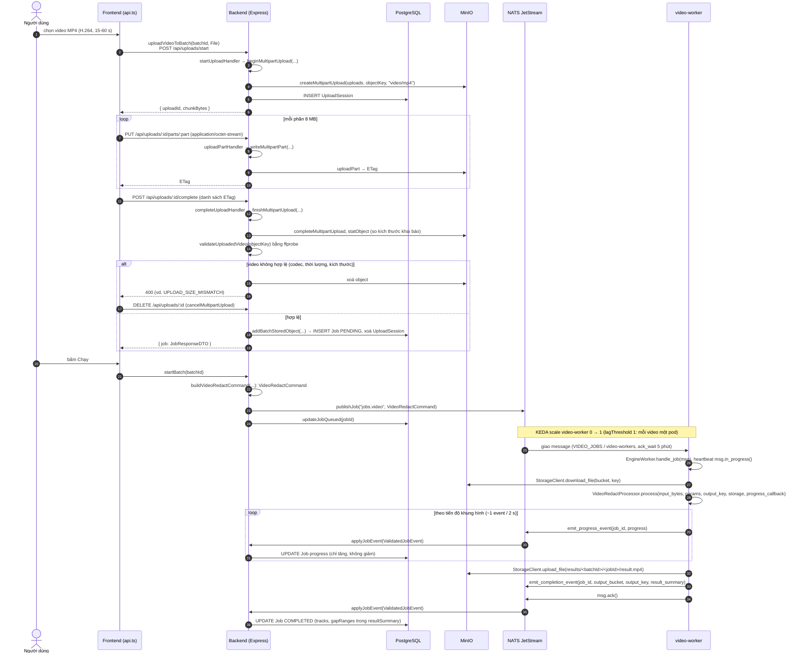

# Hình 3.6: Biểu đồ tuần tự ca sử dụng UC02 Tải lên và xử lý video

Batch nháp được tạo như UC01; ở đây chỉ vẽ phần khác: multipart upload, kiểm tra video, pipeline video.

```mermaid
sequenceDiagram
    autonumber
    actor U as Người dùng
    participant FE as Frontend (api.ts)
    participant BE as Backend (Express)
    participant PG as PostgreSQL
    participant S3 as MinIO
    participant MQ as NATS JetStream
    participant W as video-worker

    U->>FE: chọn video MP4 (H.264, 15-60 s)
    FE->>BE: uploadVideoToBatch(batchId, File)<br/>POST /api/uploads/start
    BE->>BE: startUploadHandler → beginMultipartUpload(...)
    BE->>S3: createMultipartUpload(uploads, objectKey, "video/mp4")
    BE->>PG: INSERT UploadSession
    BE-->>FE: { uploadId, chunkBytes }

    loop mỗi phần 8 MB
        FE->>BE: PUT /api/uploads/:id/parts/:part (application/octet-stream)
        BE->>BE: uploadPartHandler → writeMultipartPart(...)
        BE->>S3: uploadPart → ETag
        BE-->>FE: ETag
    end

    FE->>BE: POST /api/uploads/:id/complete (danh sách ETag)
    BE->>BE: completeUploadHandler → finishMultipartUpload(...)
    BE->>S3: completeMultipartUpload, statObject (so kích thước khai báo)
    BE->>BE: validateUploadedVideo(objectKey) bằng ffprobe
    alt video không hợp lệ (codec, thời lượng, kích thước)
        BE->>S3: xoá object
        BE-->>FE: 400 (vd. UPLOAD_SIZE_MISMATCH)
        FE->>BE: DELETE /api/uploads/:id (cancelMultipartUpload)
    else hợp lệ
        BE->>PG: addBatchStoredObject(...) → INSERT Job PENDING, xoá UploadSession
        BE-->>FE: { job: JobResponseDTO }
    end

    U->>FE: bấm Chạy
    FE->>BE: startBatch(batchId)
    BE->>BE: buildVideoRedactCommand(...): VideoRedactCommand
    BE->>MQ: publishJob("jobs.video", VideoRedactCommand)
    BE->>PG: updateJobQueued(jobId)

    Note over MQ,W: KEDA scale video-worker 0 → 1 (lagThreshold 1: mỗi video một pod)
    MQ->>W: giao message (VIDEO_JOBS / video-workers, ack_wait 5 phút)
    W->>W: EngineWorker.handle_job(msg), heartbeat msg.in_progress()
    W->>S3: StorageClient.download_file(bucket, key)
    W->>W: VideoRedactProcessor.process(input_bytes, params, output_key, storage, progress_callback)
    loop theo tiến độ khung hình (~1 event / 2 s)
        W->>MQ: emit_progress_event(job_id, progress)
        MQ->>BE: applyJobEvent(ValidatedJobEvent)
        BE->>PG: UPDATE Job progress (chỉ tăng, không giảm)
    end
    W->>S3: StorageClient.upload_file(results/<batchId>/<jobId>/result.mp4)
    W->>MQ: emit_completion_event(job_id, output_bucket, output_key, result_summary)
    W->>MQ: msg.ack()
    MQ->>BE: applyJobEvent(ValidatedJobEvent)
    BE->>PG: UPDATE Job COMPLETED (tracks, gapRanges trong resultSummary)
```
