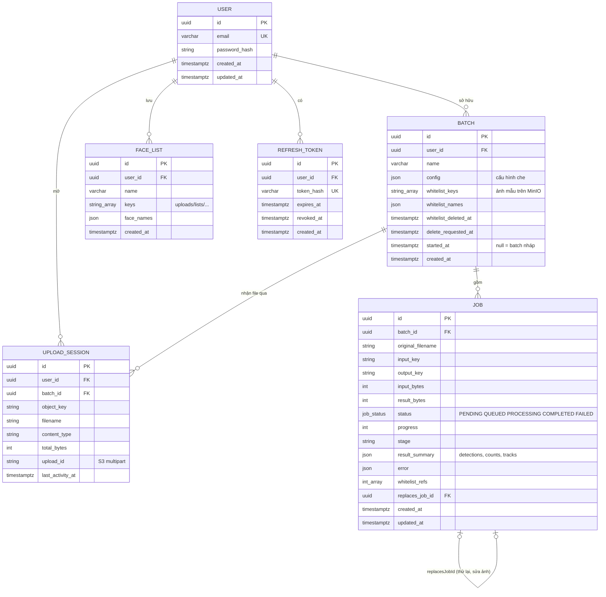

# Hình 3.8: Biểu đồ thực thể liên kết (ERD) của cơ sở dữ liệu

Sinh tay từ web/backend/prisma/schema.prisma (tên bảng thật trong ngoặc ở chú thích).

```mermaid
erDiagram
    USER ||--o{ BATCH : "sở hữu"
    USER ||--o{ FACE_LIST : "lưu"
    USER ||--o{ REFRESH_TOKEN : "có"
    USER ||--o{ UPLOAD_SESSION : "mở"
    BATCH ||--o{ JOB : "gồm"
    BATCH ||--o{ UPLOAD_SESSION : "nhận file qua"
    JOB |o--o| JOB : "replacesJobId (thử lại, sửa ảnh)"

    USER {
        uuid id PK
        varchar email UK
        string password_hash
        timestamptz created_at
        timestamptz updated_at
    }
    BATCH {
        uuid id PK
        uuid user_id FK
        varchar name
        json config "cấu hình che"
        string_array whitelist_keys "ảnh mẫu trên MinIO"
        json whitelist_names
        timestamptz whitelist_deleted_at
        timestamptz delete_requested_at
        timestamptz started_at "null = batch nháp"
        timestamptz created_at
    }
    JOB {
        uuid id PK
        uuid batch_id FK
        string original_filename
        string input_key
        string output_key
        int input_bytes
        int result_bytes
        job_status status "PENDING QUEUED PROCESSING COMPLETED FAILED"
        int progress
        string stage
        json result_summary "detections, counts, tracks"
        json error
        int_array whitelist_refs
        uuid replaces_job_id FK
        timestamptz created_at
        timestamptz updated_at
    }
    FACE_LIST {
        uuid id PK
        uuid user_id FK
        varchar name
        string_array keys "uploads/lists/..."
        json face_names
        timestamptz created_at
    }
    REFRESH_TOKEN {
        uuid id PK
        uuid user_id FK
        varchar token_hash UK
        timestamptz expires_at
        timestamptz revoked_at
        timestamptz created_at
    }
    UPLOAD_SESSION {
        uuid id PK
        uuid user_id FK
        uuid batch_id FK
        string object_key
        string filename
        string content_type
        int total_bytes
        string upload_id "S3 multipart"
        timestamptz last_activity_at
    }
```
