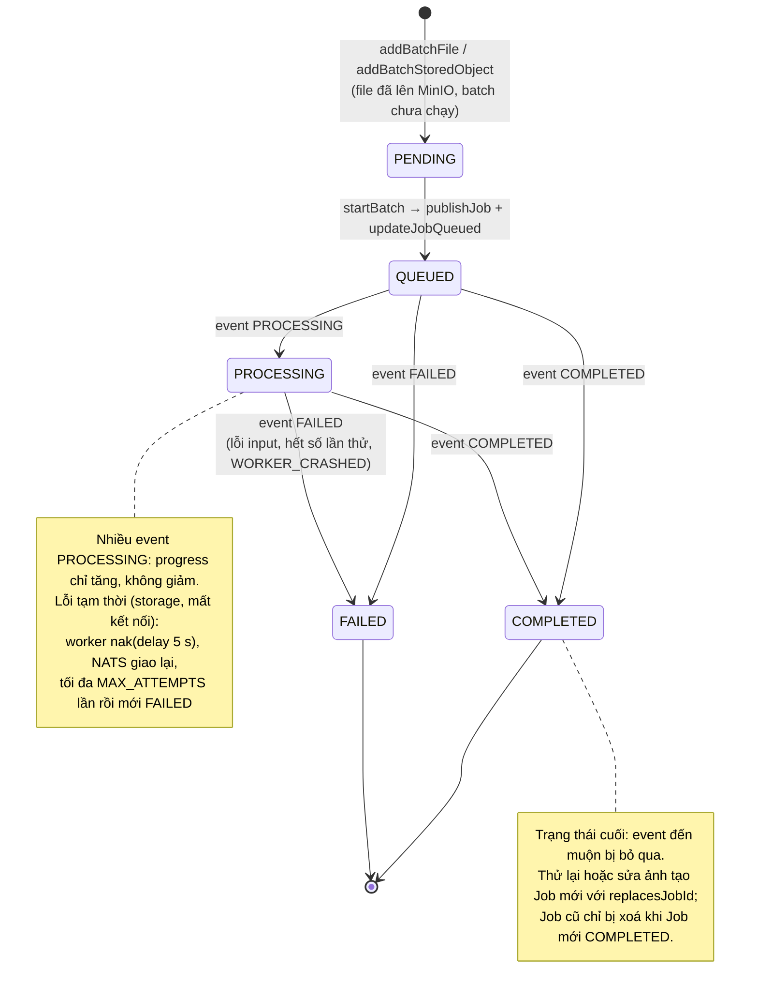

# Hình 3.9: Biểu đồ trạng thái của Job (JobStatus)

Nguồn: web/backend/src/domain/job-state.ts (calculateNextJobState), repositories/job.repository.ts, docs/integration-contracts.md §4, §8.

```mermaid
stateDiagram-v2
    [*] --> PENDING: addBatchFile / addBatchStoredObject<br/>(file đã lên MinIO, batch chưa chạy)
    PENDING --> QUEUED: startBatch → publishJob + updateJobQueued
    QUEUED --> PROCESSING: event PROCESSING
    QUEUED --> COMPLETED: event COMPLETED
    PROCESSING --> COMPLETED: event COMPLETED
    QUEUED --> FAILED: event FAILED
    PROCESSING --> FAILED: event FAILED<br/>(lỗi input, hết số lần thử, WORKER_CRASHED)
    COMPLETED --> [*]
    FAILED --> [*]

    note right of PROCESSING
        Nhiều event PROCESSING: progress chỉ tăng, không giảm.
        Lỗi tạm thời (storage, mất kết nối):
        worker nak(delay 5 s), NATS giao lại,
        tối đa MAX_ATTEMPTS lần rồi mới FAILED
    end note
    note right of COMPLETED
        Trạng thái cuối: event đến muộn bị bỏ qua.
        Thử lại hoặc sửa ảnh tạo Job mới với replacesJobId;
        Job cũ chỉ bị xoá khi Job mới COMPLETED.
    end note
```
