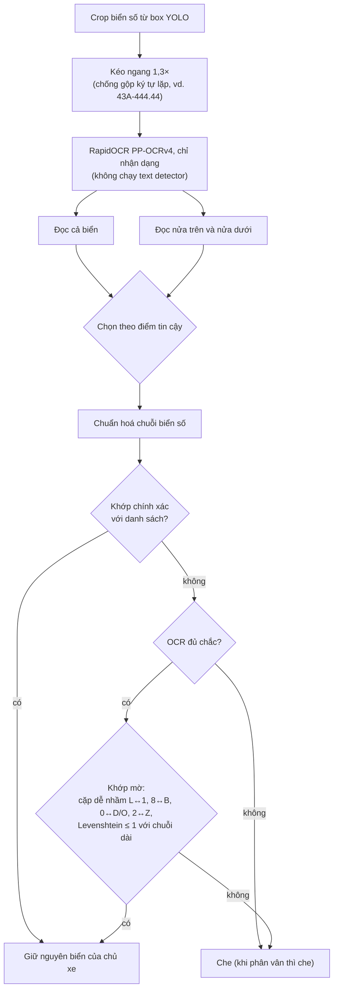

# Hình 4.10: Pipeline OCR biển số whole_or_split

Nguồn: engine/src/processors/plate_ocr.py, engine/docs/plate-ocr-technical-report.md.

```mermaid
flowchart TB
    A["Crop biển số từ box YOLO"] --> B["Kéo ngang 1,3×<br/>(chống gộp ký tự lặp, vd. 43A-444.44)"]
    B --> C["RapidOCR PP-OCRv4, chỉ nhận dạng<br/>(không chạy text detector)"]
    C --> D1["Đọc cả biển"]
    C --> D2["Đọc nửa trên và nửa dưới"]
    D1 --> E{"Chọn theo điểm tin cậy"}
    D2 --> E
    E --> F["Chuẩn hoá chuỗi biển số"]
    F --> G{"Khớp chính xác<br/>với danh sách?"}
    G -- có --> K["Giữ nguyên biển của chủ xe"]
    G -- không --> H{"OCR đủ chắc?"}
    H -- không --> L["Che (khi phân vân thì che)"]
    H -- có --> I{"Khớp mờ:<br/>cặp dễ nhầm L↔1, 8↔B, 0↔D/O, 2↔Z,<br/>Levenshtein ≤ 1 với chuỗi dài"}
    I -- có --> K
    I -- không --> L
```
