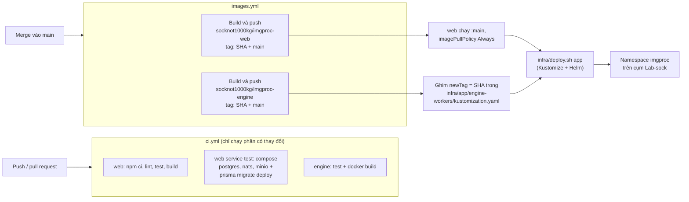

# Hình 5.2: Quy trình CI/CD với GitHub Actions

Nguồn: .github/workflows/ci.yml, .github/workflows/images.yml, infra/deploy.sh, decisions.md (G.13).

```mermaid
flowchart LR
    DEV["Push / pull request"] --> CI
    subgraph CI["ci.yml (chỉ chạy phần có thay đổi)"]
        W1["web: npm ci, lint, test, build"]
        W2["web service test: compose<br/>postgres, nats, minio +<br/>prisma migrate deploy"]
        E1["engine: test + docker build"]
    end
    MAIN["Merge vào main"] --> IMG
    subgraph IMG["images.yml"]
        I1["Build và push<br/>socknot1000kg/imgproc-web<br/>tag: SHA + main"]
        I2["Build và push<br/>socknot1000kg/imgproc-engine<br/>tag: SHA + main"]
    end
    I1 --> D1["web chạy :main,<br/>imagePullPolicy Always"]
    I2 --> D2["Ghim newTag = SHA trong<br/>infra/app/engine-workers/kustomization.yaml"]
    D1 --> DEP["infra/deploy.sh app<br/>(Kustomize + Helm)"]
    D2 --> DEP
    DEP --> LAB["Namespace imgproc<br/>trên cụm Lab-sock"]
```
